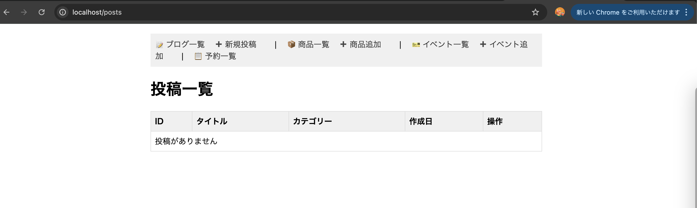
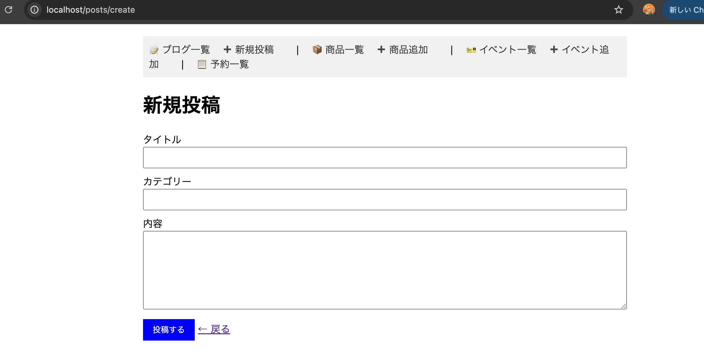
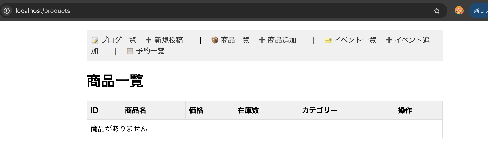
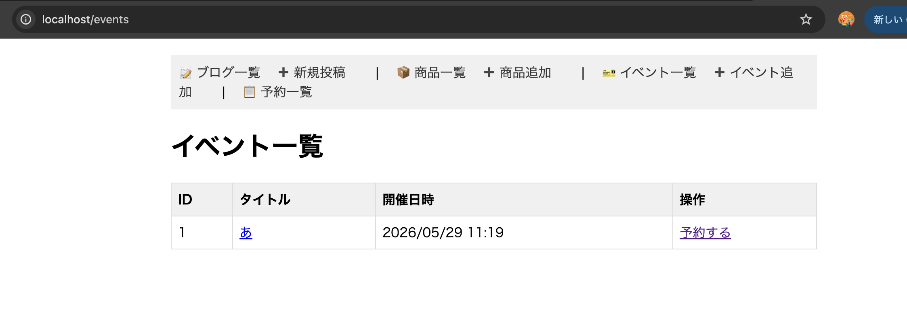
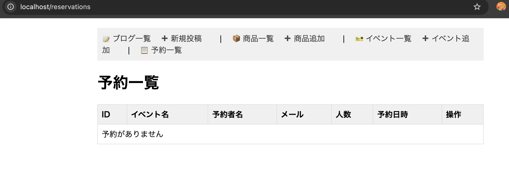

# Week7 課題 - Laravel MVCブログシステム

## 機能説明

### 基本課題：ブログシステム
- 投稿一覧表示（ページネーション付き）
- 投稿詳細表示
- 投稿作成（タイトル、内容、カテゴリー）
- 投稿編集
- 投稿削除
- バリデーション実装
- Bladeレイアウト継承

### 練習課題1：商品管理システム
- 商品一覧表示
- 商品詳細表示
- 商品作成（商品名、価格、説明、在庫数、カテゴリー）
- 商品編集
- 商品削除

### 練習課題2：予約システム
- イベント一覧・詳細表示
- イベント作成
- 予約作成（名前、メール、人数、日時）
- 予約一覧
- 予約キャンセル

## テーブル定義

### postsテーブル
| カラム名 | 型 | 説明 |
|---|---|---|
| id | integer | 主キー |
| title | string | タイトル |
| content | text | 内容 |
| category | string | カテゴリー |
| created_at | timestamp | 作成日時 |
| updated_at | timestamp | 更新日時 |

### productsテーブル
| カラム名 | 型 | 説明 |
|---|---|---|
| id | integer | 主キー |
| name | string | 商品名 |
| price | integer | 価格 |
| description | text | 説明 |
| stock | integer | 在庫数 |
| category | string | カテゴリー |
| created_at | timestamp | 作成日時 |
| updated_at | timestamp | 更新日時 |

### eventsテーブル
| カラム名 | 型 | 説明 |
|---|---|---|
| id | integer | 主キー |
| title | string | タイトル |
| description | text | 説明 |
| event_date | datetime | 開催日時 |
| created_at | timestamp | 作成日時 |
| updated_at | timestamp | 更新日時 |

### reservationsテーブル
| カラム名 | 型 | 説明 |
|---|---|---|
| id | integer | 主キー |
| event_id | integer | イベントID（外部キー） |
| name | string | 予約者名 |
| email | string | メールアドレス |
| number_of_people | integer | 人数 |
| reserved_at | datetime | 予約日時 |
| created_at | timestamp | 作成日時 |
| updated_at | timestamp | 更新日時 |

## スクリーンショット

### 投稿一覧

### 投稿作成フォーム

### 商品一覧

### イベント一覧

### 予約一覧
